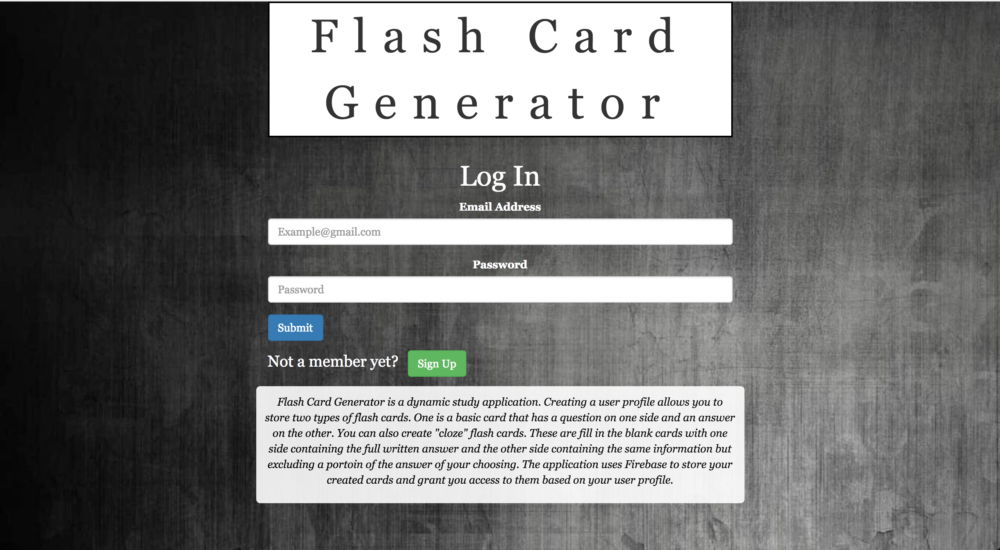
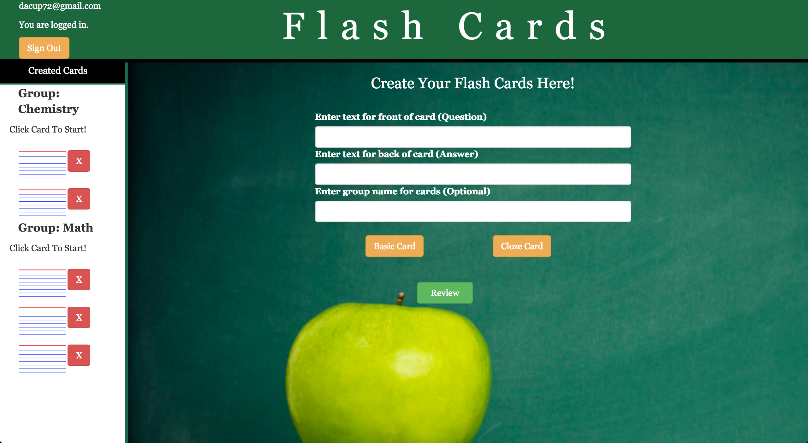
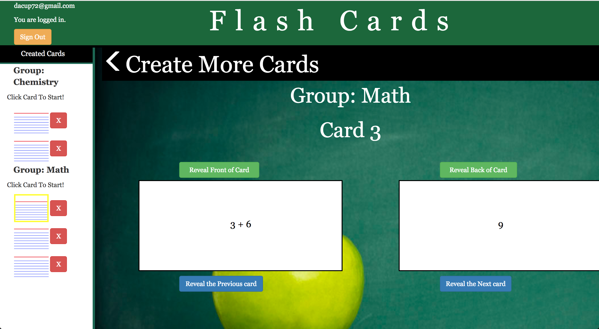

Visit Application: https://dacup72.github.io/Flashcard-Generator/

# Flashcard-Generator

FlashCard-Fun is designed to be a web-based application that helps users to learn information in an interactive and fun manner. Users are required to sign up with a username and password so that their created cards can be saved and can be reviewed at their leisure.

## Creating Cards

Once a user logs in they are started on the create cards screen.  Here users create a front and a back for two different types of flash cards.  The first type is a basic card. This is kind of a freedom card because it basically allows you to put anything for a question and anything for an answer. The second type of card is a cloze card or a fill in the blank card.  This requires that the exact phrase you want removed from the question is entered as the back of the card.  Each time a user creates a card you can see it populate in the sidebar to the left, which contains all created cards.

## Reviewing Cards

There are two ways to review cards.  Click the review cards on the create card screen.  This will start the user with the first card in the first group.  You can also click on any card in the sidebar to review that card.  Once you are reviewing a card from that screen you are able to review previous or next cards or simply click the card in the card sidebar to review it.  

## Technologies Used
* Html
* Bootstrap
* Css
* Animate Css
* Firebase
* Javascript
* JQuery 